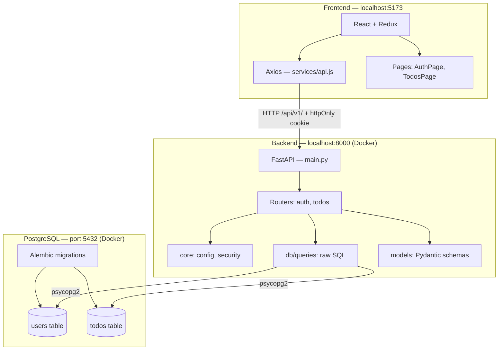
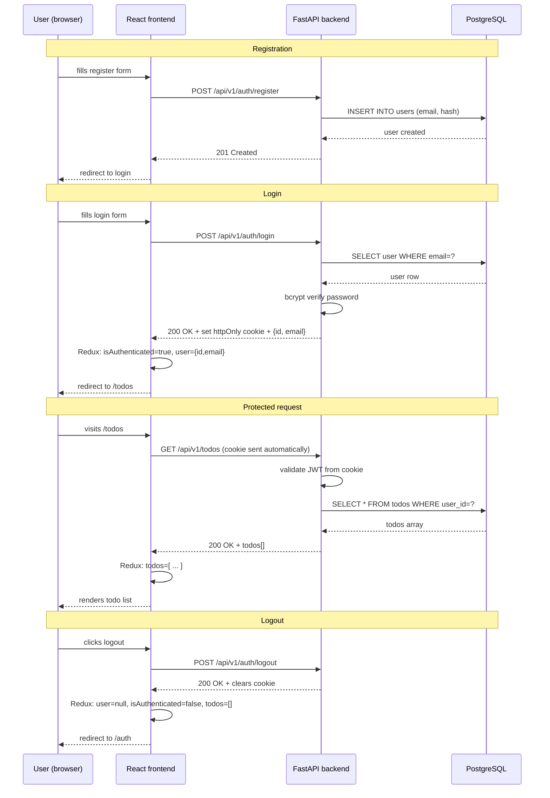
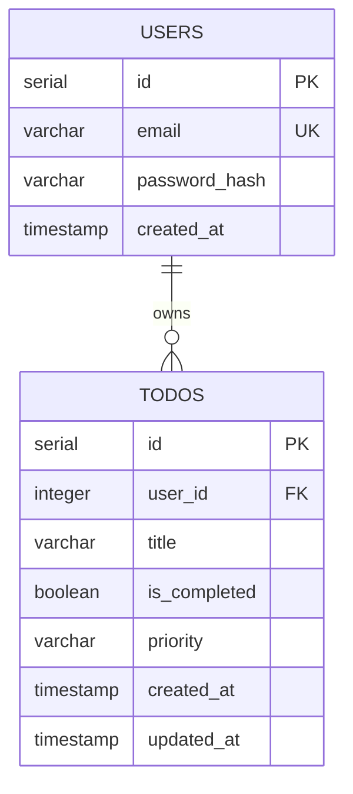
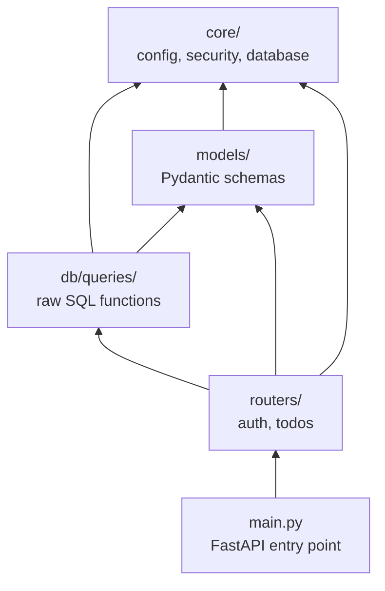
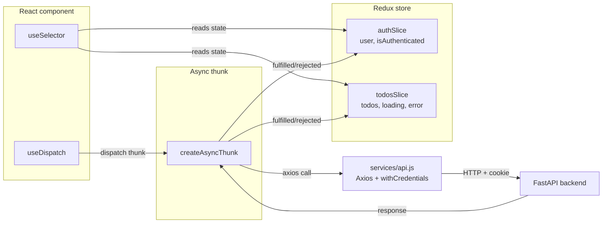

# ADR-008: Architecture Diagrams

## Status
Living document — updated with each version

## Date
2026-06-24

## Purpose

This ADR is a living visual map of the system.
Unlike other ADRs which document a single decision, this one
tracks how the architecture looks at each product version.

When the architecture changes (new feature, new service, new table),
a new version section is added below the current one.
Old versions are never deleted — they are the history of how the
system grew.

How to update this ADR:
1. Copy the latest version section
2. Increment the version number
3. Update only what changed
4. Add a one-line note explaining what changed

---

## How to render these diagrams

These diagrams use Mermaid syntax.

- GitHub renders Mermaid automatically in markdown files
- VSCode: install the "Markdown Preview Mermaid Support" extension
- Cline and most AI editors understand Mermaid natively

---

## v1.0 — Initial architecture (2026-06-24)

Scope: user auth + todo CRUD.
Stack: React + Redux → FastAPI → PostgreSQL (Docker).

---

### System architecture



---

### Auth flow



---

### Database schema



---

### Dependency direction (backend modules)



Rule: arrows point inward only.
If you ever draw an arrow going the other way, stop and refactor.

---

### Frontend state flow



---

## Changelog

| Version | Date | What changed |
|---------|------|-------------|
| v1.0 | 2026-06-24 | Initial architecture — auth + todo CRUD |

---

## How future versions will look

When a feature from ADR-005 (deferred scope) is picked up,
a new section is added here. Example:

```
## v1.1 — Added todo categories (future)

Changes from v1.0:
- New categories table added to PostgreSQL
- New todo_categories join table
- New router: routers/categories.py
- Frontend: new categoriesSlice in Redux

[updated diagrams follow]
```

The v1.0 diagrams above remain unchanged.
